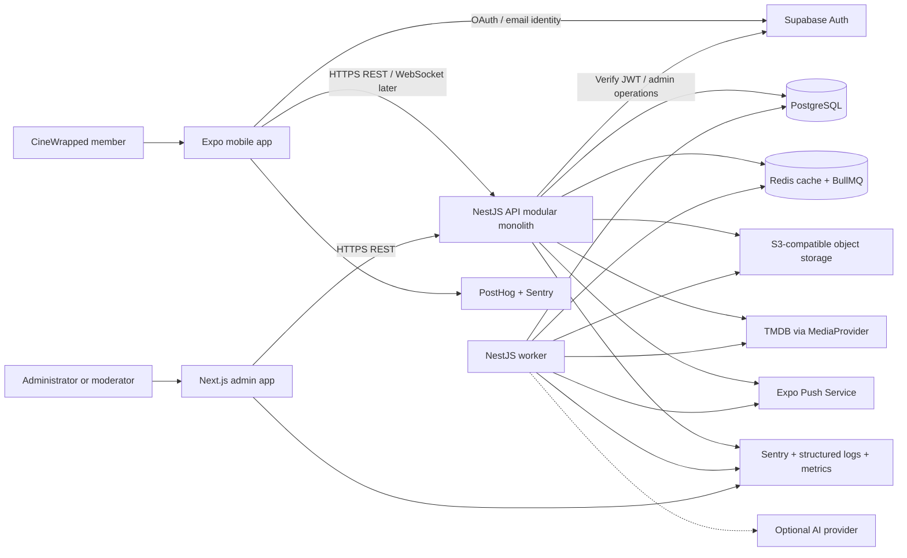
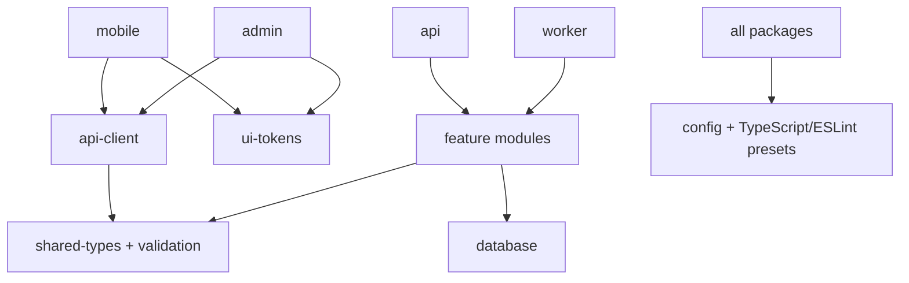
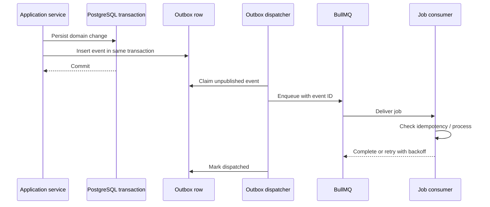
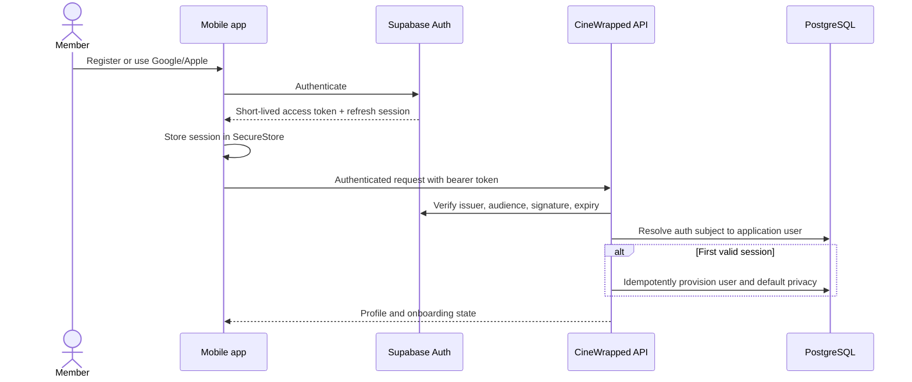
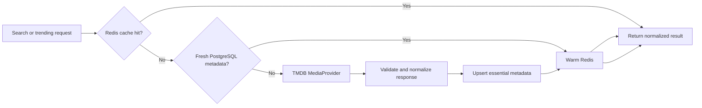
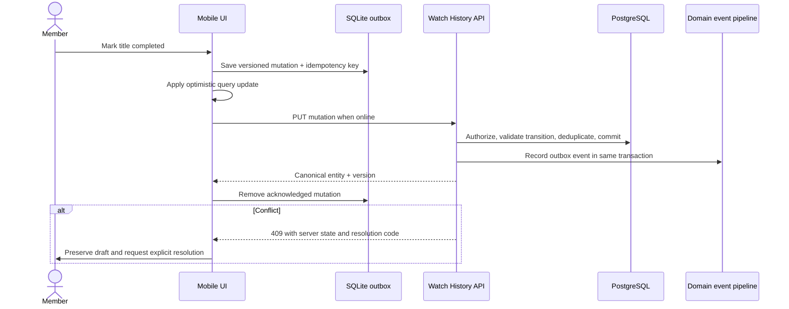
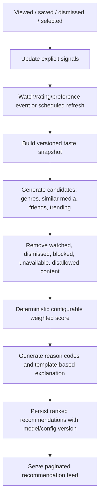
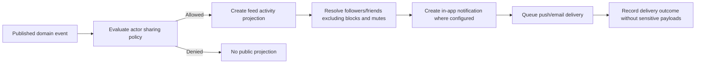
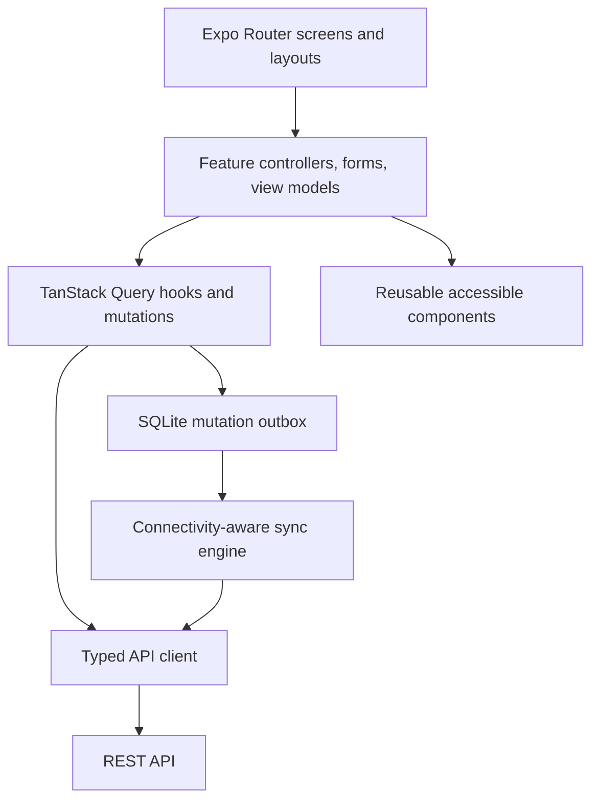
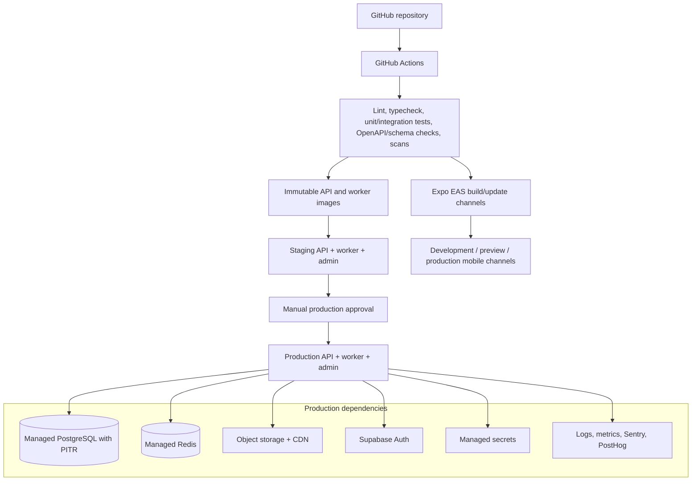

# CineWrapped System Architecture

**Status:** Proposed baseline for Task 1  
**Version:** 0.1  
**Date:** 2026-08-01  
**Scope:** MVP foundation with explicit extension points for post-MVP phases

## 1. Executive summary

CineWrapped will be delivered as a TypeScript monorepo with four deployable applications: an Expo mobile client, a NestJS REST API, a Next.js administration panel, and a NestJS/BullMQ background worker. PostgreSQL is the system of record, Redis supports caching and asynchronous jobs, Supabase Auth manages user identity, and an S3-compatible object store holds user-generated media and generated wrap cards.

The backend is a modular monolith rather than a collection of microservices. Feature modules own their business rules and data access, communicate synchronously through explicit application services, and publish durable domain events for non-blocking side effects. The API and worker share domain packages but run as separate processes so user-facing requests are isolated from recommendation generation, metadata synchronization, notifications, and wrap rendering.

This architecture is intentionally incremental. The MVP avoids premature service decomposition while preserving clear seams around identity, metadata providers, object storage, notifications, analytics, and AI. A module becomes a separate service only when measured scale, reliability, security, or team ownership requires it.

## 2. Architecture goals and constraints

### 2.1 Goals

- Deliver the MVP through independently testable phases without redesigning the platform at each phase.
- Keep provider secrets and privileged data operations on trusted backend infrastructure.
- Preserve user actions during intermittent connectivity and make synchronization conflicts visible.
- Guarantee object-level authorization for private activity, reviews, lists, journals, wraps, and social relationships.
- Keep recommendation and wrap outputs explainable and grounded in stored user activity.
- Support multiple countries, languages, time zones, and streaming markets from the first schema design.
- Provide structured observability, repeatable deployments, and auditable administrative actions.
- Keep brand, provider, deployment, and AI integrations replaceable behind typed interfaces.

### 2.2 Constraints

- The mobile application uses React Native, Expo, TypeScript, and Expo Router.
- The initial public contract is versioned REST; WebSockets are additive and not required for core mutations.
- PostgreSQL is authoritative. Redis is never the sole store for user-created state.
- The first recommendation engine is deterministic. Generative AI cannot invent taste signals or wrap statistics.
- The mobile app never receives TMDB, service-role, database, Redis, object-storage, or AI provider secrets.
- Task 1 defines architecture only. Application code and schemas begin in later ordered tasks.

### 2.3 Architecture principles

1. **One source of truth:** remote domain state belongs in PostgreSQL and TanStack Query, not Zustand.
2. **Own your boundary:** every backend module owns its rules and repository surface; controllers do not access Prisma directly.
3. **Synchronous core, asynchronous effects:** commit the user-visible state first, then dispatch durable side effects through an outbox.
4. **Private by default:** feeds, wraps, analytics, and notifications consume only visibility-filtered projections.
5. **Idempotent mutations:** retried mobile actions and background jobs must not duplicate domain effects.
6. **Measure before splitting:** retain a modular monolith until operational evidence justifies service extraction.
7. **Provider isolation:** external identity, media, storage, notification, analytics, and AI providers sit behind ports.
8. **Progressive delivery:** unfinished post-MVP capabilities remain disabled through server-controlled feature flags.

## 3. Context and high-level architecture



### 3.1 Deployable units

| Unit          | Responsibility                                                                               | Scaling characteristic                           |
| ------------- | -------------------------------------------------------------------------------------------- | ------------------------------------------------ |
| `apps/mobile` | Authentication UX, onboarding, discovery, tracking, social UI, offline queue, wraps          | Distributed through Expo EAS; no trusted secrets |
| `apps/api`    | REST/OpenAPI contract, authorization, transactions, reads, WebSocket gateway when introduced | Stateless horizontal replicas                    |
| `apps/worker` | BullMQ consumers, scheduled jobs, outbox dispatch, wrap rendering, notifications             | Scale by queue and concurrency                   |
| `apps/admin`  | Moderation, support, feature flags, audit views, operational controls                        | Stateless web deployment, restricted access      |

### 3.2 Authoritative stores

| Data class                                                                       | Authority      | Cache or replica                                                        |
| -------------------------------------------------------------------------------- | -------------- | ----------------------------------------------------------------------- |
| Identity credentials and external sessions                                       | Supabase Auth  | SecureStore holds the client session token                              |
| CineWrapped profiles, relationships, activity, preferences, privacy, and content | PostgreSQL     | Redis and client query cache                                            |
| Provider metadata normalized for application use                                 | PostgreSQL     | Redis; poster images remain provider-hosted when permitted              |
| User uploads and generated share cards                                           | Object storage | CDN                                                                     |
| Job state                                                                        | Redis/BullMQ   | Durable job outcome records in PostgreSQL where product-visible         |
| Analytics events                                                                 | PostHog        | No sensitive payloads; product state never reconstructed from analytics |

## 4. Technology decisions

### 4.1 Client

| Area                | Decision                                                                    | Rationale                                                                          |
| ------------------- | --------------------------------------------------------------------------- | ---------------------------------------------------------------------------------- |
| Runtime             | React Native with Expo and Expo Router                                      | Cross-platform delivery, managed native integrations, file-based navigation        |
| Language            | Strict TypeScript                                                           | Shared types and early contract failures                                           |
| Server state        | TanStack Query                                                              | Cache, pagination, retries, invalidation, and optimistic mutations                 |
| Local UI state      | Zustand                                                                     | Small, transient state only: theme, modals, drafts, filters, onboarding navigation |
| Forms               | React Hook Form with Zod                                                    | Performant forms with schemas reusable at API boundaries                           |
| Tokens              | Expo SecureStore                                                            | Hardware-backed storage where supported; no tokens in AsyncStorage                 |
| Offline persistence | TanStack Query persistence plus a dedicated mutation outbox in local SQLite | Durable ordered retries without treating UI state as remote truth                  |
| Lists and images    | FlashList and Expo Image                                                    | Virtualization and controlled image caching                                        |
| Motion              | Reanimated and Gesture Handler                                              | Native-thread interactions; all motion honors `reduceMotion`                       |

SQLite is selected for the offline mutation outbox because retries, ordering, payload versioning, and conflict metadata need transactional persistence. AsyncStorage may store harmless preferences, but not access tokens or the authoritative mutation queue.

### 4.2 Backend and persistence

| Area            | Decision                                                                             | Rationale                                                                                   |
| --------------- | ------------------------------------------------------------------------------------ | ------------------------------------------------------------------------------------------- |
| API framework   | NestJS with the Fastify adapter                                                      | Modular dependency injection, guards, validation, OpenAPI, testability, lower HTTP overhead |
| Architecture    | Modular monolith                                                                     | Fast iteration and atomic transactions without distributed-system overhead                  |
| ORM             | Prisma                                                                               | Type-safe access, migrations, explicit transactions, shared schema package                  |
| Database        | PostgreSQL 16+                                                                       | Relational integrity, JSONB where justified, full-text/trigram options, mature indexing     |
| Cache and queue | Redis with BullMQ                                                                    | Request caching, rate-limit counters, delayed jobs, retries, queue isolation                |
| Internal events | Transactional outbox plus typed in-process event contracts                           | Prevents state commit/event publish gaps and supports future extraction                     |
| API style       | REST under `/api/v1` with OpenAPI                                                    | Mobile-friendly, cacheable, testable, and explicit versioning                               |
| Real time       | WebSocket gateway added for notification badges/comments after REST flows are stable | Real-time delivery remains a projection; core mutations still use REST                      |

### 4.3 Providers and operations

| Capability     | Initial choice                                                       | Port or abstraction                        |
| -------------- | -------------------------------------------------------------------- | ------------------------------------------ |
| Authentication | Supabase Auth                                                        | `IdentityProvider` and server JWT verifier |
| Media metadata | TMDB                                                                 | `MediaProvider`                            |
| Object storage | S3-compatible storage; Supabase Storage is the default hosted option | `ObjectStorage`                            |
| Email          | Provider selected during environment setup; local Mailpit            | `EmailSender`                              |
| Push           | Expo Notifications                                                   | `PushNotificationSender`                   |
| Analytics      | PostHog                                                              | `AnalyticsSink` with allow-listed events   |
| Errors         | Sentry                                                               | Framework adapters and source maps         |
| AI             | Disabled for the deterministic MVP; OpenAI-compatible port reserved  | `AiService`                                |

Provider adapters are configured through dependency injection. Domain modules depend on application-owned interfaces, never provider SDK types.

## 5. Monorepo and dependency direction

```text
cinewrapped/
  apps/
    mobile/
    api/
    admin/
    worker/
  packages/
    api-client/
    analytics/
    config/
    database/
    eslint-config/
    shared-types/
    typescript-config/
    ui-tokens/
    validation/
  infrastructure/
    docker/
    scripts/
  docs/
    architecture/
    api/
    database/
    deployment/
    product/
```

Allowed dependency direction:



Rules:

- `mobile` and `admin` never import `database` or backend feature internals.
- `api-client` contains generated or hand-wrapped OpenAPI client types, not business rules.
- `shared-types` contains stable primitives and wire-safe types only; it does not become a dumping ground for server entities.
- Feature modules may depend on explicitly exported application services from another module, not its repository implementation.
- Circular module dependencies fail architecture tests and CI.

## 6. Backend module boundaries

The MVP begins with the modules below. Later-phase modules remain documented but are not scaffolded as fake implementations.

### 6.1 Platform modules

| Module          | Owns                                                                       | Exposes                                    |
| --------------- | -------------------------------------------------------------------------- | ------------------------------------------ |
| `config`        | Validated environment configuration and feature flags                      | Typed configuration tokens                 |
| `database`      | Prisma lifecycle, transaction boundary, health checks                      | Database service and transaction runner    |
| `common`        | Request IDs, response envelope, base errors, clocks, pagination primitives | Framework-independent utilities            |
| `auth`          | JWT verification, identity linking, session/device metadata, role guards   | Authenticated principal and auth use cases |
| `jobs`          | Queue registration, outbox dispatcher, retries, dead-letter policy         | Typed job publisher and consumers          |
| `observability` | Logging, traces, error reporting, metrics                                  | Correlation-aware telemetry facade         |
| `feature-flags` | Environment and user/cohort flag evaluation                                | Server-authoritative flag decisions        |
| `audit`         | Append-only security and administrative audit events                       | Audit writer and authorized query service  |

### 6.2 Product modules

| Module                | Data ownership and rules                                                 | May synchronously call                             |
| --------------------- | ------------------------------------------------------------------------ | -------------------------------------------------- |
| `users`               | Application user, lifecycle, deletion state                              | `auth`, `audit`                                    |
| `profiles`            | Public profile, preferences, privacy, onboarding state                   | `users`, `media` for favorite selections           |
| `media`               | Normalized movie/show/season/episode metadata                            | `metadata-provider`                                |
| `metadata-provider`   | Provider adapters, mapping, caching policy, synchronization              | Platform HTTP/cache only                           |
| `search`              | Search orchestration and recent search history                           | `media`, `profiles`                                |
| `streaming-providers` | Country-specific availability snapshots                                  | `media`, `metadata-provider`                       |
| `watch-history`       | Status transitions, viewings, episode progress, rewatches                | `media`, `profiles`                                |
| `watchlists`          | Default/custom lists and list items                                      | `media`, `profiles`                                |
| `ratings`             | Rating modes and normalized score                                        | `media`, `profiles`                                |
| `reviews`             | Draft/publish lifecycle, spoilers, visibility, ownership                 | `media`, `profiles`                                |
| `recommendations`     | Taste profile, candidate scoring, explanations, feedback                 | Read models from media/activity; not provider SDKs |
| `follows`             | Directional following, block/mute constraints                            | `profiles`, `notifications` asynchronously         |
| `friendships`         | Mutual request state machine and compatibility access                    | `profiles`                                         |
| `feed`                | Visibility-filtered activity projection and ranking                      | Consumes domain events; reads profiles/media       |
| `comments`            | Threaded comments, spoiler flag, ownership/moderation state              | Target authorization resolver                      |
| `reactions`           | Idempotent reactions and counters                                        | Target authorization resolver                      |
| `notifications`       | In-app notification records and delivery preferences                     | Push/email adapters asynchronously                 |
| `statistics`          | Materialized or query-time aggregates for the member                     | Watch/rating/media read models                     |
| `wraps`               | Period definition, immutable input snapshot, slide JSON, share artifacts | `statistics`, storage, worker                      |
| `achievements`        | Criteria definitions and per-user progress                               | Consumes domain events                             |

Post-MVP modules (`collections`, `journal`, `clubs`, `challenges`, collaborative lists, watch parties, advanced AI, and moderation expansions) follow the same ownership rules and are activated only in their scheduled phase.

### 6.3 Cross-module communication rules

- A controller calls one application use case in its own module.
- A use case may call a public application service of another module for an immediate invariant check.
- Repositories are private to their owning module.
- A transaction may span modules only through a named orchestration service and the shared transaction context.
- Non-critical side effects use domain events and the transactional outbox.
- Event payloads carry identifiers and minimal non-sensitive facts; consumers load authorized data as needed.
- Consumers must be idempotent, using an event ID or natural idempotency key.

## 7. Domain events and background processing

### 7.1 Event lifecycle



The outbox closes the failure window in which a watch event could commit but its statistics, feed, achievement, or recommendation work could be lost. BullMQ jobs use bounded exponential backoff, per-job timeouts, attempt limits, and dead-letter queues. Product-visible job outcomes such as wraps have PostgreSQL status records independent of BullMQ retention.

### 7.2 Initial domain event catalog

- `user.registered.v1`
- `profile.onboarding-completed.v1`
- `watch-history.status-changed.v1`
- `watch-history.completed.v1`
- `rating.upserted.v1`
- `review.published.v1`
- `follow.created.v1`
- `friendship.accepted.v1`
- `comment.created.v1`
- `reaction.created.v1`
- `wrap.requested.v1`
- `wrap.generated.v1`
- `achievement.unlocked.v1`

Event names and payload schemas are versioned. Backward-incompatible payload changes receive a new version.

## 8. Core data flows

### 8.1 Authentication and profile provisioning



The API never trusts a client-supplied user ID for ownership. Ownership is derived from the verified token subject. Supabase webhooks may accelerate provisioning, but first-request provisioning remains idempotent so webhook delay cannot block login.

### 8.2 Media discovery



Provider failures return stale cached data when policy permits, otherwise a typed dependency error. Search requests are debounced on the client, rate-limited on the API, and cached only with country/language/filter dimensions included in the key.

### 8.3 Offline media logging and synchronization



Status changes are idempotent commands. Additive events such as rewatches carry stable client-generated operation IDs so retrying does not increment counts twice. The API returns canonical timestamps and an entity version. The client never silently discards a rejected offline action.

### 8.4 Recommendation generation



Scores, component contributions, reason codes, configuration version, and the input snapshot version are retained. Human-readable explanations are generated from deterministic templates. AI enrichment, if later enabled, may rephrase an explanation but cannot add unsupported reasons.

### 8.5 Wrap generation and sharing

```mermaid
sequenceDiagram
    participant Scheduler
    participant API as Wrap service
    participant DB as PostgreSQL
    participant Queue as BullMQ
    participant Worker
    participant Store as Object storage

    Scheduler->>API: Request period wrap with idempotency key
    API->>DB: Create PENDING wrap and freeze period boundaries
    API->>Queue: Enqueue generation via outbox
    Worker->>DB: Mark GENERATING and read authorized activity snapshot
    Worker->>Worker: Calculate statistics and structured slides
    Worker->>Store: Render approved public share card
    Worker->>DB: Store stats, slides, artifact URL; mark COMPLETED
    Worker->>Queue: Publish wrap.generated event
```

Wrap statistics use the user's time zone and immutable period boundaries. The private in-app story and public share card are separate render targets. The share payload includes only fields allowed by the user's current share settings and is revalidated before URL issuance.

### 8.6 Social activity and notifications



Feed visibility is checked both when an activity is created and when it is read. This protects against stale projections after privacy, friendship, mute, or block changes.

## 9. API architecture

- All public routes are rooted at `/api/v1`.
- DTOs are validated at the edge and mapped into domain commands; unknown fields are rejected for sensitive mutations.
- Responses use a consistent success/error envelope with a request ID.
- Cursor pagination is the default for feeds and time-ordered collections. Bounded page/limit pagination is reserved for stable administrative tables.
- Mutations that may be retried accept `Idempotency-Key`; the server binds the key to user, route, and request hash.
- Conditional updates carry an entity version or `If-Match` token where conflict detection matters.
- OpenAPI is generated in CI and checked for unreviewed breaking changes.
- Rate limiting is layered by IP for unauthenticated routes and by authenticated user plus action for protected routes.
- WebSockets authenticate during connection setup, use short-lived authorization, and never bypass the same object-level policies as REST.

The detailed endpoint, DTO, error, and authorization matrix belongs to Task 3.

## 10. Mobile architecture

### 10.1 Layers



Screens compose feature APIs and reusable UI components; they do not call `fetch` directly. Query keys are defined centrally by feature. Optimistic updates include rollback context. Zustand stores only transient interface state and non-sensitive preferences.

### 10.2 Session handling

- Access and refresh session material is stored through Expo SecureStore.
- The API client attaches access tokens in memory and serializes refresh attempts to avoid token races.
- Sign-out clears SecureStore, in-memory credentials, private query caches, pending notification tokens, and user-scoped offline data after confirmed sync or explicit user choice.
- Deep links are validated against an allow-listed route grammar before navigation.

### 10.3 Offline conflict policy

| Mutation              | Default conflict rule                                                                     |
| --------------------- | ----------------------------------------------------------------------------------------- |
| Add watchlist item    | Set semantics; duplicate add succeeds idempotently                                        |
| Remove watchlist item | Tombstone wins only if based on same or newer version                                     |
| Change watch status   | Latest explicit user action wins if transition is valid; otherwise return conflict        |
| Log rewatch           | Additive operation keyed by client operation ID                                           |
| Rating                | Last explicit write wins with server timestamp and prior value retained in audit metadata |
| Review draft          | Preserve both versions and require merge when both changed                                |
| Publish review        | Server validation and current privacy always win; rejected draft remains local            |

## 11. Security model

### 11.1 Trust boundaries

- Mobile devices and browsers are untrusted clients.
- The public API edge is the only route to application data.
- Supabase Auth is trusted only for a cryptographically verified identity assertion; application authorization remains in CineWrapped.
- Provider responses are untrusted external input and are validated before caching or persistence.
- Redis, queues, analytics, email, push, and object storage are supporting systems, not authorization authorities.
- Admin access is a separate high-trust path with stronger authentication and auditing.

### 11.2 Authentication

- Validate JWT signature against pinned issuer/JWKS configuration, audience, expiry, and algorithm.
- Link the immutable provider subject to one internal UUID; email is not an ownership key.
- Support email verification and OAuth through Supabase Auth.
- Use short-lived access tokens, rotated refresh sessions, revocation, and device/session views.
- Require recent authentication for account deletion, identity changes, data export, and high-impact admin operations.
- Require MFA for administrative roles before production launch.

### 11.3 Authorization

Authorization is evaluated in application services using a policy input of actor, action, resource, relationship, visibility, block/mute state, and administrative scope.

- Controllers never accept `userId` as proof of ownership.
- Every read and write applies object-level policy, including nested resources and generated artifacts.
- Public, friends, private, and club-only visibility are explicit enum states with deny-by-default fallbacks.
- Blocks override follows, friendships, feed visibility, search discovery, comments, reactions, and notifications.
- Admin roles use least-privilege scopes; support agents cannot silently gain moderation or content access.
- Service-role database credentials are backend-only and environment-scoped.

### 11.4 Data protection and privacy

- TLS is mandatory in transit; managed database and object-storage encryption protects data at rest.
- Secrets live in the deployment platform's secret manager and never in source control, images, logs, analytics, or mobile bundles.
- Signed upload/download URLs are short-lived and bound to object prefix, MIME type, and maximum size.
- Uploads are validated by content signature as well as declared MIME type, virus-scanned where supported, and processed outside the API request.
- Logs use allow-listed structured fields and redact tokens, email addresses, free-form review/journal text, and provider payloads.
- Analytics events contain pseudonymous IDs and allow-listed properties; analytics opt-out is enforced before dispatch.
- Private journal data never emits feed events.
- Account deletion first revokes sessions and hides the account, then an idempotent job removes or anonymizes personal data according to retention obligations.
- Export generation produces an encrypted or short-lived artifact and requires recent authentication.

### 11.5 Application and infrastructure controls

- Zod/class-validator input validation, Prisma parameterization, output encoding, secure headers, and strict CORS.
- CSRF protection for cookie-authenticated admin actions; the mobile bearer-token API does not use ambient cookies.
- Route- and action-specific rate limits with stricter thresholds for login, search, comments, invitations, reports, and uploads.
- Dependency scanning, lockfile integrity, secret scanning, container scanning, and protected CI environments.
- PostgreSQL point-in-time recovery, tested restore procedures, Redis treated as rebuildable except active queue work.
- Append-only audit records for role changes, moderation, exports, deletion, feature flags, and provider configuration.

### 11.6 Threat-focused control summary

| Threat                          | Primary controls                                                                  |
| ------------------------------- | --------------------------------------------------------------------------------- |
| Broken object authorization     | Actor derived from token, centralized policies, ownership/relationship tests      |
| Token theft                     | SecureStore, short lifetimes, refresh rotation, session revocation, log redaction |
| Duplicate offline actions       | Idempotency keys, client operation IDs, unique constraints                        |
| Spoiler/private content leakage | Visibility filter at write and read, share-card allow-list, no private analytics  |
| Provider abuse or cost spikes   | Backend-only keys, quotas, circuit breakers, cache, request coalescing            |
| Malicious uploads               | Signed scoped URLs, size/type/signature validation, isolated processing           |
| Queue replay or partial failure | Outbox, idempotent consumers, bounded retries, dead-letter review                 |
| Admin misuse                    | MFA, scoped roles, reason capture, append-only audit, alerts                      |

## 12. Deployment model

### 12.1 Environment topology



### 12.2 Recommended hosting baseline

- **Mobile:** Expo EAS with separate development, preview, and production profiles.
- **API and worker:** container-capable managed platform with private networking and independent process scaling. The initial baseline may use Railway for operational simplicity; images remain portable to Cloud Run, Fly.io, or AWS.
- **Admin:** Vercel or the same container platform, protected by application RBAC and provider access controls.
- **Database and auth:** Supabase managed PostgreSQL/Auth for the initial product, with Prisma connecting through an appropriate pooled endpoint and a direct connection reserved for migrations.
- **Redis:** managed Redis with TLS, eviction configured for cache keys, and queue memory isolated by policy or instance when load warrants.
- **Storage:** Supabase Storage initially behind `ObjectStorage`; CDN-backed public assets and private signed access are separated by bucket/prefix.

The application is not coupled to Railway or Vercel APIs. Deployment-specific configuration stays in infrastructure files, while runtime services remain standard containers.

### 12.3 Release and migration strategy

- Every commit runs formatting, linting, strict type checking, unit tests, relevant integration tests, and security checks.
- Pull requests generate migration and OpenAPI diffs.
- Production uses immutable artifacts promoted from staging, not rebuilt from a different commit.
- Database changes follow expand/migrate/contract: add compatible structures, deploy dual-compatible code, backfill asynchronously, then remove old structures in a later release.
- Prisma migrations run as a single controlled release job before traffic reaches code that requires them.
- Mobile/API compatibility spans at least the active production mobile version and the immediately previous supported version.
- Feature flags decouple deployment from release for incomplete or risky capabilities.
- Rollback favors application rollback; destructive schema contraction is never part of the same release that stops using a field.

### 12.4 Availability and recovery targets

Initial targets, to be validated against product and budget requirements:

| Concern                 | MVP target                                                     |
| ----------------------- | -------------------------------------------------------------- |
| API availability        | 99.9% monthly excluding planned maintenance                    |
| Database recovery point | 15 minutes or better through PITR                              |
| Database recovery time  | Four hours                                                     |
| Cached home experience  | Available offline from last successful sync                    |
| Critical job retry      | Automated bounded retries, dead-letter alert within 15 minutes |
| Provider outage         | Stale cache where safe; clear degraded state otherwise         |

## 13. Observability and operations

- Generate or accept a safe request ID at the edge and propagate it through logs, database diagnostics, outbox events, and jobs.
- Use structured JSON logs with environment, service, version, request/job ID, duration, outcome, and non-sensitive error code.
- Trace API calls through database, Redis, provider requests, and queue publication.
- Measure RED signals for APIs (rate, errors, duration) and queue depth, age, failure, retry, and dead-letter counts for workers.
- Monitor database pool saturation, slow queries, lock waits, replication/PITR health, and storage growth.
- Monitor TMDB error rate, latency, quota consumption, cache hit rate, and circuit-breaker state.
- Alert on authentication anomalies, authorization denials above baseline, moderation backlog, wrap failure rate, push failure rate, and deletion-job failure.
- Sentry events include release and correlation IDs but exclude private content and credentials.
- PostHog receives only the event catalog approved by privacy review and respects consent.

Health endpoints are split into liveness and readiness. Readiness verifies only dependencies required to safely serve the process; optional providers report degraded status without causing restart loops.

## 14. Performance and scalability

- Use keyset/cursor pagination for feeds, notifications, reviews, and history.
- Add indexes from the concrete Task 2 query plan, not speculative blanket indexing.
- Cache public/provider metadata with explicit TTL, stale-while-revalidate, locale/country dimensions, and request coalescing.
- Use CDN/provider image transformation rather than sending original-size posters.
- Prefetch only likely next screens and cancel abandoned search requests.
- Keep API processes stateless and cap database pool sizes across replicas.
- Move CPU- and I/O-heavy wrap rendering, metadata synchronization, exports, and recommendation batches to worker queues.
- Use precomputed read models only after query measurements show a need; every projection must be rebuildable from authoritative data.
- Separate queue concurrency by workload so a large wrap batch cannot starve notifications or account deletion.

The first scale boundary is expected to be provider quota and feed/recommendation read volume, not raw transactional writes. Caching, materialized projections, and background refresh address these before service extraction.

## 15. Key technical risks and mitigations

| Risk                                                 | Likelihood / impact        | Mitigation                                                                             | Trigger for reassessment                             |
| ---------------------------------------------------- | -------------------------- | -------------------------------------------------------------------------------------- | ---------------------------------------------------- |
| MVP scope expands into all post-MVP features         | High / High                | Phase gates, acceptance criteria, feature flags, no placeholder modules                | Phase misses or unstable core journeys               |
| Supabase identity and app-user records drift         | Medium / High              | Immutable subject mapping, idempotent provisioning, reconciliation job, webhook replay | Orphan or duplicate rate above operational threshold |
| TMDB limits, outages, or licensing changes           | Medium / High              | Provider port, normalized persistence, Redis cache, quotas, attribution review         | Sustained quota pressure or terms change             |
| Offline mutations conflict or duplicate              | Medium / High              | SQLite outbox, operation IDs, idempotency records, entity versions, visible merge UX   | Conflict rate or replay incidents exceed target      |
| Privacy leaks through feeds, wraps, or notifications | Medium / Critical          | Central policy service, write/read checks, share allow-list, privacy test matrix       | Any confirmed leakage; immediate incident response   |
| Modular monolith degrades into tight coupling        | Medium / High              | Repository privacy, explicit exports, dependency tests, ADR review                     | Cycles or cross-module DB access appears             |
| Queue jobs are lost, replayed, or poison the queue   | Medium / High              | Transactional outbox, idempotent consumers, limits, DLQ, alerts                        | Repeated manual replay or growing oldest-job age     |
| Wrap rendering is memory/CPU intensive               | Medium / Medium            | Dedicated queue/concurrency, deterministic renderer, cached assets, workload limits    | P95 generation exceeds product target                |
| Recommendation cold start produces weak results      | High / Medium              | Onboarding favorites/preferences, transparent popular/editorial fallback               | Low save/select rate after onboarding                |
| Prisma migrations lock large tables                  | Low initially / High later | Expand-contract, online index strategy, backfills, staging rehearsal                   | Table growth or migration duration threshold         |
| WebSocket infrastructure adds fragility              | Medium / Medium            | Add only after REST/push works; no critical mutation depends on socket delivery        | Product requires presence/live discussions           |
| Vendor concentration in Supabase                     | Medium / Medium            | Standard PostgreSQL, provider ports, exported assets, no client DB access              | Pricing, region, feature, or compliance mismatch     |
| Social abuse and moderation load                     | Medium / High              | Blocks, reports, rate limits, audit trail, staged social rollout                       | Report volume or safety SLA breach                   |

## 16. Tradeoffs and rejected alternatives

### 16.1 Modular monolith over microservices

**Chosen because:** MVP development benefits from atomic transactions, one deployment model, shared observability, and simpler local development.  
**Cost:** modules can become coupled without enforcement and scale together at the API boundary.  
**Exit path:** extract a module only when it has a stable event/API contract and a measured independent scaling or reliability need. Likely early candidates are wrap rendering, media synchronization, and notification delivery—not core transactional modules.

### 16.2 Supabase Auth over custom authentication

**Chosen because:** verified email, password reset, Google/Apple OAuth, refresh management, and session revocation are security-sensitive commodity capabilities.  
**Cost:** provider dependency, webhook reconciliation, and platform-specific operational behavior.  
**Exit path:** the internal user UUID and `IdentityProvider` boundary prevent provider subjects from becoming domain identifiers.

### 16.3 REST over GraphQL

**Chosen because:** the MVP has clear resource workflows, benefits from HTTP semantics and generated OpenAPI clients, and needs straightforward authorization and observability.  
**Cost:** some home/feed screens require composed endpoints or multiple queries.  
**Exit path:** introduce purpose-built aggregation endpoints first; consider GraphQL only after persistent client query-shape pressure is measured.

### 16.4 PostgreSQL as the authoritative system over event sourcing

**Chosen because:** the product needs relational constraints, flexible queries, and direct operational understandability.  
**Cost:** not every historical state is automatically reconstructable.  
**Exit path:** keep explicit immutable viewing events, audit records, and an outbox where history matters without adopting full event sourcing.

### 16.5 Transactional outbox over direct queue publishing

**Chosen because:** user changes and their asynchronous consequences must not diverge during partial failure.  
**Cost:** dispatcher complexity, event retention, and eventual consistency.  
**Exit path:** retain the pattern even if the queue technology changes; it is part of the consistency model.

### 16.6 Local SQLite outbox over AsyncStorage-only offline support

**Chosen because:** the offline queue needs transactions, indexes, ordered retries, schema versions, and conflict records.  
**Cost:** mobile migration and lifecycle complexity.  
**Exit path:** the sync-engine interface isolates storage details and can adopt an Expo-maintained alternative if needed.

### 16.7 Deterministic recommendations over ML-first recommendations

**Chosen because:** early data volume is limited and users need explanations grounded in observed behavior.  
**Cost:** hand-tuned weights and less nuanced ranking.  
**Exit path:** retain candidates, features, feedback, and evaluation data so learned ranking can replace scoring behind the same interface.

### 16.8 Managed services over self-hosted infrastructure

**Chosen because:** a small product team should spend its capacity on reliable product behavior rather than database, identity, and queue operations.  
**Cost:** recurring cost, provider limits, and some migration effort.  
**Exit path:** containers, PostgreSQL, Redis, S3-compatible storage, and provider interfaces keep the core portable.

## 17. Architecture decision criteria for future extraction

A feature is considered for a separate service only if at least one condition is measured and material:

- It needs a different runtime or scaling profile that causes unacceptable cost or latency in the monolith.
- Its failure domain must be isolated to meet a defined availability objective.
- It requires a separate data residency or security boundary.
- A dedicated team owns a stable contract and independent release cadence.
- Queue isolation and process separation are insufficient.

Extraction requires a versioned contract, data ownership plan, migration/rollback path, distributed tracing, and an explicit consistency model. “The codebase is large” alone is not sufficient.

## 18. Decisions deferred to later ordered tasks

Task 1 intentionally does not define implementation-level details that belong to the next required artifacts:

- Exact Prisma models, indexes, constraints, deletion cascades, and migrations: **Task 2**.
- Complete endpoint/DTO/error/authorization contract and OpenAPI configuration: **Task 3**.
- Screen inventory, navigation states, component tokens, and accessibility behavior: **Task 4**.
- Exact package versions, scripts, containers, CI jobs, and environment schemas: **Task 5**.
- Authentication/onboarding application code and tests: **Task 6**.

## 19. Task 1 acceptance checklist

- [x] High-level architecture and system context documented.
- [x] Technology decisions and provider abstractions selected.
- [x] Backend and monorepo module boundaries defined.
- [x] Authentication, discovery, offline logging, recommendations, wraps, and notification flows diagrammed.
- [x] Security trust boundaries, authentication, authorization, privacy, and infrastructure controls documented.
- [x] Deployment, release, migration, availability, and recovery model documented.
- [x] Key risks, mitigations, tradeoffs, and exit paths recorded.
- [x] Later tasks explicitly separated to prevent premature implementation.
