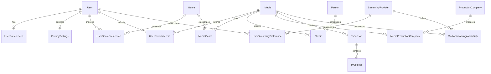
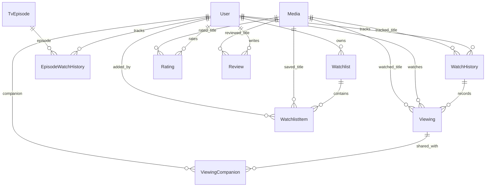
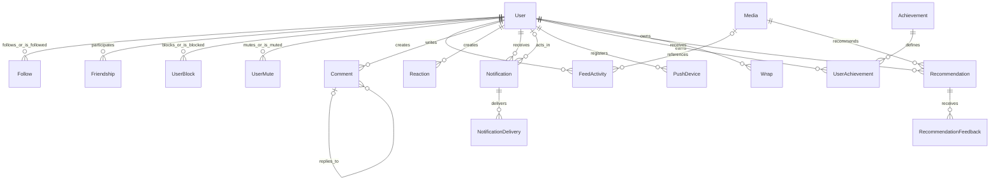
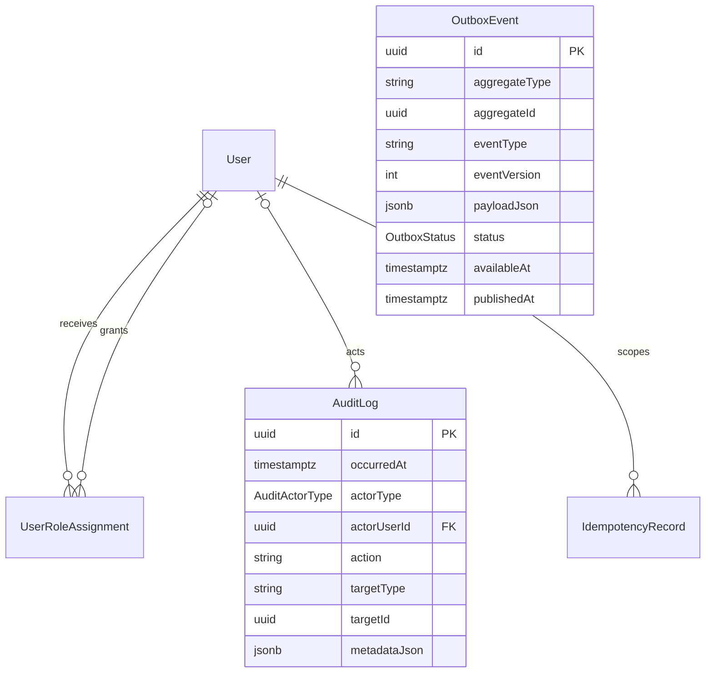

# CineWrapped Database Design

**Status:** Task 2 baseline  
**Schema:** [`packages/database/prisma/schema.prisma`](../../packages/database/prisma/schema.prisma)  
**Database:** PostgreSQL 16 or newer  
**ORM:** Prisma 6.18 baseline

## 1. Purpose and scope

This document defines the persistence design that implements the Task 1 architecture and supports the MVP acceptance criteria. It covers the Prisma schema, entity relationships, query-driven indexes, database constraints, soft deletion, auditing, and migration policy.

The design includes the data structures needed for the MVP and platform reliability. It does not add application endpoints, DTOs, repository code, or deployment configuration; those remain in Tasks 3–5.

## 2. Modeling principles

- Internal identifiers are UUIDs and never reuse external provider identifiers.
- PostgreSQL is authoritative for product state; Redis and client caches are rebuildable.
- Current watch state and individual viewing events are separate records.
- Provider metadata is normalized for core queries while the original non-critical payload may be retained in JSONB.
- Relationships that require integrity use foreign keys. Polymorphic social targets are guarded through application policy and reconciliation because PostgreSQL cannot attach one foreign key to several tables.
- User-generated records preserve ownership and timestamps. Soft deletion is limited to records that need recovery, moderation, or feed retraction.
- Retried mutations use operation IDs or idempotency records.
- All timestamps representing moments use `timestamptz(3)` and are stored in UTC. User time zones are retained separately for period calculations.
- Enumerations represent stable closed state machines. Provider payloads and evolving presentation documents use validated JSONB.
- Counter columns are cached projections, not independent truth, and must be reconcilable.

## 3. Model inventory and ownership

| Domain               | Models                                                                                                                     | Authority or purpose                                                         |
| -------------------- | -------------------------------------------------------------------------------------------------------------------------- | ---------------------------------------------------------------------------- |
| Identity and profile | `User`, `UserPreferences`, `PrivacySettings`, `UserGenrePreference`, `UserFavoriteMedia`, `UserStreamingPreference`        | Application identity mapping, onboarding, taste inputs, and privacy defaults |
| Media catalog        | `Media`, `Genre`, `MediaGenre`, `Person`, `Credit`, `ProductionCompany`, `MediaProductionCompany`, `TvSeason`, `TvEpisode` | Normalized provider metadata                                                 |
| Streaming            | `StreamingProvider`, `MediaStreamingAvailability`                                                                          | Country-specific, expiring availability snapshots                            |
| Tracking             | `WatchHistory`, `Viewing`, `ViewingCompanion`, `EpisodeWatchHistory`                                                       | Current status/progress plus immutable watch occurrences                     |
| Library and opinion  | `Watchlist`, `WatchlistItem`, `Rating`, `Review`                                                                           | Saved titles, ratings, and reviews                                           |
| Social graph         | `Follow`, `Friendship`, `UserBlock`, `UserMute`                                                                            | Directional follows, mutual friendships, safety overrides                    |
| Social content       | `FeedActivity`, `Comment`, `Reaction`                                                                                      | Visibility-filtered projections and interactions                             |
| Notifications        | `Notification`, `PushDevice`, `NotificationDelivery`                                                                       | In-app records, encrypted device tokens, channel outcomes                    |
| Insights             | `Achievement`, `UserAchievement`, `Challenge`, `UserChallenge`, `Recommendation`, `RecommendationFeedback`, `Wrap`         | Deterministic product insights, gamification, and generated artifacts        |
| Operations           | `UserRoleAssignment`, `AuditLog`, `OutboxEvent`, `IdempotencyRecord`                                                       | Authorization, auditability, durable events, safe retries                    |

## 4. Important modeling decisions

### 4.1 External identity versus application user

`User.authSubject` stores the immutable Supabase subject and is unique. The internal `User.id` UUID is referenced by every product table. Email and username are stored with normalized counterparts so uniqueness is deterministic and independent of database collation.

Account credentials, refresh tokens, email verification state, and OAuth secrets are not duplicated in this database. Supabase Auth remains their authority.

### 4.2 Watch state versus viewing history

`WatchHistory` is unique by `(userId, mediaId)` and answers “what is the member's current relationship to this title?” It holds status, current progress, last-watched time, and an optimistic concurrency version.

`Viewing` answers “when was this title watched?” Every completion or rewatch creates a separate viewing. Statistics and wraps aggregate non-deleted viewings rather than inferring occurrences from a mutable counter. `WatchHistory.watchCount` is a cached projection that can be reconciled from `Viewing`.

`EpisodeWatchHistory` is the current per-member, per-episode state. Its stable client operation ID makes offline retries safe.

### 4.3 Genre preferences

Genre likes and dislikes use `UserGenrePreference`, not UUID arrays. The join table provides foreign-key integrity and guarantees a genre cannot be both preferred and disliked for the same user. Language, country, decade, content-type, and emotional-tag sets remain scalar arrays because they are bounded value lists rather than entity relationships.

### 4.4 Friendships

`Friendship.userAId` and `userBId` store the pair in canonical UUID order. This makes the unique constraint effective regardless of who sent the request. `requesterId` and `addresseeId` preserve request direction. SQL checks enforce that the two representations contain the same two users.

### 4.5 Social polymorphism

Feed activities, comments, reactions, notifications, and audit targets use an enum type plus UUID target. A single relational foreign key cannot point to multiple target tables. Target existence, target-type agreement, object authorization, and deletion behavior are therefore enforced by target-resolver services inside the same transaction. A scheduled integrity check reports orphaned polymorphic targets.

### 4.6 JSONB boundaries

JSONB is used only where the shape is provider-specific, versioned, or presentation-oriented:

- Raw supplemental provider metadata
- Notification preference map
- Feed activity display metadata
- Achievement criteria
- Challenge windows, metrics, participation, progress, and completion
- Recommendation feature context
- Wrap statistics, highlights, and structured story slides
- Audit metadata and outbox payloads

Every JSONB document has an application-level Zod schema and a stored schema/version discriminator where its shape may evolve. Frequently filtered values graduate to typed columns rather than accumulating JSON expression indexes.

## 5. Entity relationship diagrams

The diagrams are split by bounded context so relationships remain readable. Operational models are shown separately.

### 5.1 Identity, preference, and media catalog



### 5.2 Tracking, library, and reviews



### 5.3 Social, notification, and insight data



### 5.4 Authorization, audit, and reliability



## 6. Index plan

### 6.1 Index rules

- Primary keys and unique constraints supply their own B-tree indexes.
- Composite indexes follow equality filters first, then sort/range fields, then a stable UUID cursor.
- Member-owned list queries begin with `userId` so one member's workload stays localized.
- Feed-like indexes end in `id` where cursor pagination needs deterministic ordering.
- Foreign-key columns used only through their parent are not indexed automatically; reverse lookup paths receive explicit indexes.
- Soft-deleted rows are excluded from hot production indexes through partial SQL indexes when Prisma cannot express the predicate.
- GIN indexes are reserved for measured array, JSONB, or text search paths.
- Every new index must cite an API query or integrity operation and be reviewed for write amplification.

### 6.2 Primary access-path indexes

| Access path                    | Index or constraint                                                  | Purpose                              |
| ------------------------------ | -------------------------------------------------------------------- | ------------------------------------ |
| Resolve identity               | Unique `users(auth_subject)`                                         | Provision/login lookup               |
| Resolve active username/email  | Unique normalized columns; anonymized on account erasure             | Case-insensitive account lookup      |
| Browse media by popularity     | `(media_type, provider_popularity DESC)`                             | Trending movie/show lists            |
| Browse releases                | `(media_type, release_date DESC)`                                    | New and upcoming titles              |
| Refresh stale provider data    | `(last_synced_at)`                                                   | Worker batch selection               |
| Retrieve a show's structure    | Unique `(media_id, season_number)` and `(season_id, episode_number)` | Season and episode navigation        |
| Streaming filter               | `(country_code, streaming_provider_id, monetization_type, media_id)` | Availability by market/provider      |
| Current library/status         | `(user_id, status, updated_at DESC)`                                 | Watching, completed, dropped lists   |
| Viewing history                | `(user_id, watched_at DESC, id)`                                     | Journal, statistics, and wraps       |
| Media popularity among members | `(media_id, watched_at DESC)`                                        | Aggregate and friend activity inputs |
| Episode progress               | Unique `(user_id, episode_id)`                                       | Canonical episode state              |
| Watchlist browse               | `(user_id, updated_at DESC)` and unique `(watchlist_id, position)`   | List index and stable ordering       |
| Member ratings/reviews         | `(user_id, updated_at DESC)`                                         | Profile activity                     |
| Title reviews                  | `(media_id, status, published_at DESC, id)`                          | Detail-page review feed              |
| Followers/friends              | Reverse follow index and request/addressee status indexes            | Social graph and pending requests    |
| Feed                           | `(visibility, occurred_at DESC, id)` and actor equivalent            | Global/friend feed candidates        |
| Comments                       | `(parent_type, parent_id, created_at, id)`                           | Thread pagination                    |
| Reactions                      | `(target_type, target_id, reaction_type)`                            | Counts and viewer state              |
| Notifications                  | `(user_id, read_at, created_at DESC, id)`                            | Inbox and unread queries             |
| Recommendations                | `(user_id, dismissed_at, expires_at, score DESC)`                    | Active personalized ranking          |
| Wrap archive                   | `(user_id, period_end DESC, id)`                                     | Profile archive                      |
| Outbox dispatch                | `(status, available_at, created_at)`                                 | Claim ready events                   |
| Audit search                   | Actor, target, action, and request ID indexes                        | Support and security investigation   |
| Idempotency cleanup            | `(expires_at)`                                                       | TTL deletion batch                   |

### 6.3 Initial migration-only indexes

Prisma does not express all required PostgreSQL indexes. The first migration will add:

```sql
CREATE EXTENSION IF NOT EXISTS pg_trgm;

CREATE INDEX media_title_trgm_idx
  ON media USING gin (title gin_trgm_ops);

CREATE INDEX people_name_trgm_idx
  ON people USING gin (name gin_trgm_ops);

CREATE UNIQUE INDEX watchlists_one_active_default_per_user_idx
  ON watchlists (user_id)
  WHERE is_default = true AND deleted_at IS NULL;

CREATE UNIQUE INDEX reviews_one_active_per_user_media_idx
  ON reviews (user_id, media_id)
  WHERE deleted_at IS NULL;

CREATE INDEX feed_activities_active_visibility_cursor_idx
  ON feed_activities (visibility, occurred_at DESC, id)
  WHERE deleted_at IS NULL;

CREATE INDEX notifications_active_inbox_idx
  ON notifications (user_id, read_at, created_at DESC, id)
  WHERE deleted_at IS NULL;

CREATE INDEX outbox_ready_idx
  ON outbox_events (available_at, created_at)
  WHERE status IN ('PENDING', 'FAILED');
```

Index names are pinned so schema reviews and operational tooling can refer to them consistently.

## 7. Constraint plan

### 7.1 Constraints represented directly in Prisma

- UUID primary keys on entity records and composite primary keys on pure join tables.
- Unique external provider identities for media, people, companies, genres, seasons, episodes, and streaming providers.
- Unique normalized username, normalized email, and auth subject.
- Unique current watch history, episode progress, rating, list membership, follow, reaction kind, and recommendation feedback action.
- Foreign keys with explicit `Cascade`, `Restrict`, or `SetNull` behavior.
- Bounded string and decimal database types.
- Non-null state fields and safe defaults.

### 7.2 PostgreSQL check constraints added by migration

The following checks must be present in the initial migration because Prisma schema syntax does not declare them:

| Table                                      | Constraint intent                                                                                                                  |
| ------------------------------------------ | ---------------------------------------------------------------------------------------------------------------------------------- |
| `users`                                    | Normalized values equal `lower(trim(source))`; username matches `^[a-z0-9_]{3,30}$`; ISO country is uppercase; version is positive |
| `user_preferences`                         | Runtime minimum/maximum are positive and ordered; mainstream preference is 0–100; country code is uppercase                        |
| `media`                                    | Release year is plausible, runtime is positive, provider rating is 0–10, popularity is non-negative                                |
| `tv_seasons`, `tv_episodes`                | Season/episode numbers are non-negative; episode count/runtime are positive when present                                           |
| `media_streaming_availability`             | Country code is uppercase; expiry is after fetch time                                                                              |
| `watch_history`                            | Progress is 0–100; seconds and watch count are non-negative; version is positive                                                   |
| `viewings`                                 | Duration is positive when present; completion cannot precede watch time                                                            |
| `viewing_companions`                       | Companion cannot equal the viewing owner, enforced through service/trigger because owner is in another table                       |
| `episode_watch_history`                    | Progress and watch count are non-negative; version is positive                                                                     |
| `watchlists`, `watchlist_items`            | Position is non-negative; version is positive                                                                                      |
| `ratings`                                  | Scale is 5 or 10 when numeric; value is within scale; normalized score is 0–100; numeric and like/dislike modes are mutually valid |
| `reviews`                                  | Published records have `published_at`; draft records do not require it; counters and version are non-negative/positive             |
| `follows`, `user_blocks`, `user_mutes`     | Actor and target differ                                                                                                            |
| `friendships`                              | `user_a_id < user_b_id`; requester/addressee differ; both are members of the canonical pair; response time matches status          |
| `comments`                                 | A comment cannot parent itself; body is non-blank after trimming                                                                   |
| `notifications`                            | Actor, when present, may not be the recipient for social notification types                                                        |
| `user_achievements`                        | Progress and target are non-negative; target is positive; unlocked progress meets target                                           |
| `wraps`                                    | Period end is after start; completed wraps have generated time and content; failed wraps have a failure code                       |
| `recommendations`                          | Score is 0–1; expiry follows generation                                                                                            |
| `notification_deliveries`, `outbox_events` | Attempt count is non-negative                                                                                                      |
| `user_role_assignments`                    | Grantor cannot equal subject unless an initial bootstrap operation is explicitly audited                                           |
| `audit_logs`                               | User/admin actors have either an internal actor ID or external subject; system actor rules are distinct                            |
| `idempotency_records`                      | Expiry follows creation; completed records have a response status                                                                  |

Representative SQL:

```sql
ALTER TABLE watch_history
  ADD CONSTRAINT watch_history_progress_range_chk
  CHECK (progress_percent >= 0 AND progress_percent <= 100),
  ADD CONSTRAINT watch_history_counts_chk
  CHECK (watch_count >= 0 AND (progress_seconds IS NULL OR progress_seconds >= 0));

ALTER TABLE friendships
  ADD CONSTRAINT friendships_canonical_pair_chk
  CHECK (user_a_id < user_b_id),
  ADD CONSTRAINT friendships_direction_chk
  CHECK (
    requester_id <> addressee_id
    AND requester_id IN (user_a_id, user_b_id)
    AND addressee_id IN (user_a_id, user_b_id)
  );

ALTER TABLE wraps
  ADD CONSTRAINT wraps_period_chk
  CHECK (period_end > period_start);
```

### 7.3 Constraints requiring application policy

Some invariants span polymorphic targets, external identity, or authorization context and cannot be represented as a local row check:

- Reserved username validation and confusable-character policy.
- A selected favorite or streaming provider is allowed during the current onboarding phase.
- `WatchHistory.mediaId` represents the same title as every attached `Viewing.mediaId` and owner as `Viewing.userId`.
- A viewing companion is an accepted friend where the user's privacy policy requires it.
- A collaborative watchlist contributor is authorized to add the item.
- Comment, reaction, notification, and feed target types agree with an existing visible target.
- A blocked relationship prevents new follows, friendships, comments, reactions, shares, and notifications.
- Review and comment visibility never exceeds the referenced parent visibility.
- Recommendation feedback belongs to the same member as its recommendation.
- Wrap JSON conforms to its versioned story schema and contains only approved share fields.

These are enforced inside named application services and covered by integration tests in later phases. Reconciliation jobs detect drift caused by operational repair or legacy imports.

### 7.4 Delete behavior

| Relationship type                                                    | Database action                     | Reason                                                          |
| -------------------------------------------------------------------- | ----------------------------------- | --------------------------------------------------------------- |
| Member-owned private/product state                                   | Cascade after approved hard erasure | Required for account deletion                                   |
| Media referenced by user history, ratings, reviews, list items       | Restrict                            | Provider removal must not destroy user history                  |
| Normalized child metadata such as seasons/episodes                   | Cascade from media/season           | Rebuildable provider-owned hierarchy                            |
| Optional display references such as feed media or notification actor | Set null                            | Preserve activity/delivery record without dangling FK           |
| Achievements referenced by members                                   | Restrict                            | Definitions are deactivated, not deleted                        |
| Audit actor                                                          | Set null                            | Audit event survives actor erasure with minimized actor subject |

## 8. Soft-delete strategy

### 8.1 Models using soft deletion

`User`, `Viewing`, `Watchlist`, `Rating`, `Review`, `FeedActivity`, `Comment`, `Notification`, and `Wrap` contain `deletedAt`.

Reasons:

- Undo windows for accidental user deletion.
- Moderation visibility without destroying evidence.
- Feed retraction after source deletion.
- Retaining consistency while background jobs and caches converge.
- Account deletion staged as revoke/hide, then erase/anonymize.

### 8.2 Models using hard deletion or state transitions

- Pure membership joins and mutable preferences are hard-deleted because their removal is itself the desired state.
- Follows, blocks, and mutes are hard-deleted on reversal; security-relevant actions are captured in audit logs.
- Friendships transition status where history is product-relevant and are hard-deleted during account erasure.
- Reviews use status `HIDDEN` or `REMOVED` for moderation and `deletedAt` for user deletion.
- Achievements and providers use `isActive` or refreshed availability rather than deletion.
- Outbox/idempotency rows expire by retention policy after their operational purpose ends.

### 8.3 Query rules

- Repositories exclude `deletedAt IS NOT NULL` unless the use case explicitly requests deleted/moderation state.
- Unique active-row behavior uses partial PostgreSQL indexes where necessary.
- Restore checks active uniqueness and parent existence before clearing `deletedAt`.
- A parent soft delete emits an outbox event so feed/search/cache projections are retracted.
- Soft-deleted records never participate in recommendations, wraps, public counts, analytics, or notifications.

### 8.4 Account deletion

1. Require recent authentication and create an audited deletion request.
2. Revoke all identity sessions and disable push devices.
3. Set `User.deletedAt`, hide public projections, and stop analytics emission immediately.
4. Allow the configured recovery period where legally and product-appropriate.
5. Run an idempotent erasure job that deletes private member-owned data, removes storage objects, and anonymizes records that must be retained for fraud/security/legal obligations.
6. Replace unique email/username values with irreversible deletion aliases before final identity removal.
7. Retain only minimized audit facts under the documented retention schedule.

## 9. Audit strategy

### 9.1 Audit versus product activity

`AuditLog` is an append-only security and administration record. It is not the social `FeedActivity` stream and is never exposed through ordinary member APIs.

Audit events include:

- Administrative role grant/revoke
- Moderation hide/remove/restore and report decisions
- Account export and deletion lifecycle
- Privacy or consent changes
- Session revocation and security-sensitive identity changes
- Feature-flag and provider configuration changes
- Manual data repair, migration override, or job replay
- Access to highly sensitive support views where policy requires it

### 9.2 Audit record contents

- UTC occurrence time
- Actor type and internal actor ID when retained
- Stable action and target type codes
- Target ID where policy permits
- Request/correlation ID
- Hashed IP and user agent, not raw values
- Required reason for privileged actions
- Allow-listed, versioned metadata containing before/after summaries where appropriate

Tokens, credentials, free-form private journal content, full review bodies, provider payloads, and raw personal identifiers are prohibited from audit metadata.

### 9.3 Immutability and access

- Application database roles receive `INSERT` and scoped `SELECT`, never `UPDATE` or `DELETE`, on audit rows.
- A PostgreSQL trigger rejects mutation of `audit_logs` outside an explicitly controlled retention role.
- Administrative reads require an authorized role and are themselves audited when sensitive.
- Audit exports are encrypted and short-lived.
- Retention periods are defined by event category and jurisdiction before production launch.

### 9.4 Domain history

Business state that needs product reconstruction uses domain-specific records rather than the security audit log:

- `Viewing` for completed watches and rewatches
- `RecommendationFeedback` for ranking interactions
- `NotificationDelivery` for delivery attempts/outcomes
- `OutboxEvent` for durable domain event dispatch
- Entity `version` fields for optimistic concurrency

## 10. Migration strategy

### 10.1 Ownership and workflow

- `schema.prisma` is the reviewed model source.
- Prisma Migrate uses versioned SQL directories under `packages/database/prisma/migrations`; the initial reviewed schema is captured by `20260801190000_phase_1_foundation`.
- Handwritten SQL for checks, partial/GIN indexes, triggers, and safe data backfills lives inside the same migration and is reviewed alongside the Prisma diff.
- `prisma db push` is prohibited for shared, staging, and production databases.
- Applied migrations are immutable. Corrections use a new migration.

### 10.2 Expand, migrate, contract

1. **Expand:** add nullable columns, new tables, new enums, or compatible indexes.
2. **Deploy compatible code:** read old and new forms; dual-write only when required and bounded.
3. **Migrate:** backfill in resumable, idempotent batches with metrics and throttling.
4. **Verify:** compare row counts, null rates, constraints, and application behavior.
5. **Enforce:** add `NOT NULL`, checks, or unique constraints using low-lock techniques.
6. **Contract:** remove old paths in a later release after the supported mobile compatibility window.

Destructive contraction never ships in the same release that stops using a field.

### 10.3 Deployment process

- CI validates and formats the Prisma schema, creates a migration diff against an ephemeral PostgreSQL database, checks for drift, and runs integration tests.
- Staging applies the exact production candidate migration and runs smoke, authorization, rollback, and representative query-plan checks.
- Production migration is a single release job using the direct database connection, not the pooled runtime URL.
- The migration job takes an advisory lock to prevent concurrent runners.
- API/worker rollout begins only after compatible migrations succeed.
- Long index builds use `CREATE INDEX CONCURRENTLY` in a migration procedure that acknowledges PostgreSQL transaction limitations.
- New constraints on large tables use `NOT VALID`, then `VALIDATE CONSTRAINT` after backfill when appropriate.

### 10.4 Rollback and recovery

- Application releases are rollback-first; schemas remain backward compatible during the rollout window.
- A failed pre-deployment migration stops the release and is fixed forward.
- Data-destructive changes require a tested restoration or reverse-migration plan and a fresh backup/PITR checkpoint.
- Database point-in-time recovery is the final safety mechanism, not the normal migration rollback tool.
- Queue consumers remain compatible with at least the current and immediately previous event payload versions during rolling deployments.

### 10.5 Seed and test data

The Phase 1 idempotent development seed installs:

- Genres and streaming providers

Later phases may add clearly labeled, deterministic development fixtures for their own domains. They must remain separate from production reference seeds and may not include real credentials or fake production-path provider responses.

Production seeds contain configuration/reference data only. They never create test users or production-path mock provider responses.

## 11. Retention and partitioning outlook

Partitioning is intentionally deferred until measured volume justifies it. Likely future candidates are `audit_logs`, `outbox_events`, `feed_activities`, and `notification_deliveries`, partitioned by occurrence/creation month. Partitioning is introduced only with retention automation, cross-partition index review, and tested Prisma query behavior.

Initial retention candidates, subject to legal/privacy approval:

| Data                              | Initial policy direction                                                           |
| --------------------------------- | ---------------------------------------------------------------------------------- |
| Published outbox events           | Delete or archive after 30 days once all consumers are confirmed                   |
| Idempotency responses             | Delete after the route-specific retry window, typically 24–72 hours                |
| Notification delivery diagnostics | Retain short-term operational metadata; retain the product notification separately |
| Provider raw metadata             | Refresh/replace; do not preserve indefinite payload history                        |
| Soft-deleted user content         | Purge after recovery/moderation retention windows                                  |
| Audit events                      | Category-specific retention approved before launch                                 |

## 12. Validation and acceptance

- Prisma 6.18 successfully parsed and validated `schema.prisma` using a PostgreSQL datasource.
- The schema contains explicit relations and indexes for MVP access paths.
- PostgreSQL-only constraints and indexes are listed for the initial migration.
- Soft deletion, hard erasure, audit immutability, and migration safety are defined.
- No API contract, runtime repository, application implementation, or migration history was prematurely created.

## 13. Task 2 acceptance checklist

- [x] Prisma schema
- [x] Entity relationship diagrams
- [x] Index plan
- [x] Constraint plan
- [x] Soft-delete strategy
- [x] Audit strategy
- [x] Migration strategy
