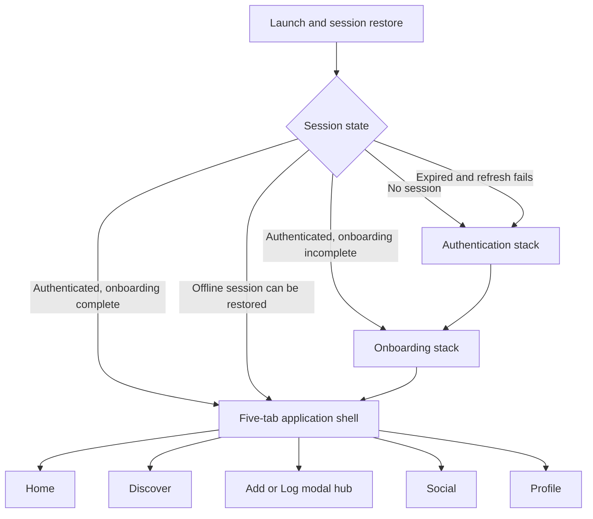
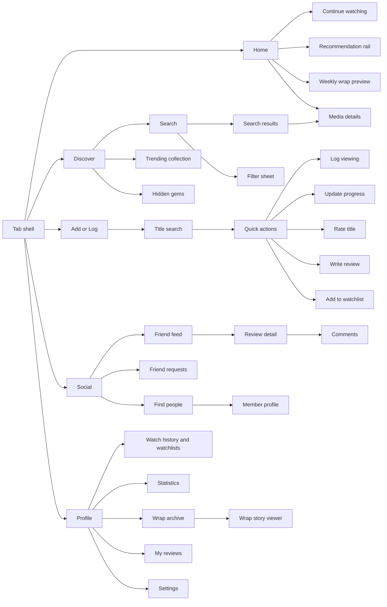

# CineWrapped Mobile Design Specification

**Status:** Task 4 baseline  
**Platforms:** iOS and Android through React Native and Expo  
**Design system:** [`DESIGN_SYSTEM.md`](../design/DESIGN_SYSTEM.md)  
**Token source:** [`design-tokens.json`](../design/design-tokens.json)

## 1. Product experience goals

CineWrapped should feel like a personal cinematic journal rather than a streaming storefront. Posters and member activity provide the visual energy; controls remain restrained, readable, and predictable.

The MVP experience must make five journeys especially easy:

1. Open the app and know what to watch or continue.
2. Find a title with as little typing and filtering as possible.
3. Log a watch, rewatch, rating, or review without losing context.
4. Understand why a recommendation appears.
5. See a meaningful, privacy-safe summary of personal viewing.

Design principles:

- **Content first:** posters, titles, people, and insights receive the strongest hierarchy.
- **Progressive disclosure:** cards show decision-making essentials; details reveal depth.
- **One primary action:** each screen has a clearly dominant next step.
- **Private by default:** visibility and sharing are explicit near the action they affect.
- **Resilient:** cached content, drafts, and queued actions remain understandable offline.
- **Explainable:** recommendations, compatibility, statistics, and wraps expose their basis.
- **Calm motion:** animation supports continuity and celebration without slowing routine logging.

## 2. Navigation architecture

### 2.1 Root navigation states



### 2.2 Five-tab shell

| Position | Tab        | Icon concept                | Behavior                                                       |
| -------: | ---------- | --------------------------- | -------------------------------------------------------------- |
|        1 | Home       | House with film frame       | Personalized dashboard and continuation                        |
|        2 | Discover   | Compass                     | Search, filters, trending, curated discovery                   |
|        3 | Add or Log | Plus inside ticket aperture | Opens action hub as a modal; does not replace the selected tab |
|        4 | Social     | Two people                  | Friend activity, reviews, requests, user discovery             |
|        5 | Profile    | Person silhouette           | Library, statistics, wraps, reviews, and settings              |

The middle action is still an accessible tab-bar element with role `button`, label “Add or log a title,” state announcement, and a 48-by-48-point minimum target. Closing the modal returns focus and scroll position to the previously selected tab.

### 2.3 Application navigation map



### 2.4 Shared modal and sheet routes

- Global search picker
- Add or Log action hub
- Log viewing form
- Rating control
- Review composer
- Watchlist picker
- Media filters
- Streaming market selector
- Share title sheet
- Share wrap sheet
- Visibility picker
- Spoiler reveal confirmation
- Offline conflict resolver
- Destructive-action confirmation
- Report/block/mute actions

Bottom sheets are used for short, reversible choices. Full-screen modals are used for keyboard-heavy composition, multi-step logging, upload progress, conflict resolution, and any flow requiring navigation protection.

## 3. Deep linking

Supported internal link shapes:

```text
cinewrapped://media/{mediaId}
cinewrapped://reviews/{reviewId}
cinewrapped://users/{username}
cinewrapped://friendships/{friendshipId}
cinewrapped://notifications
cinewrapped://wraps/{wrapId}
```

Rules:

- Parse links through an allow-listed route map; never navigate from arbitrary path strings.
- Restore or refresh the session before resolving protected content.
- Route private/blocked/missing objects to the same concealed not-found state.
- After authentication or onboarding, continue to the validated pending link.
- A notification opens the narrowest relevant screen and marks read only after the target is successfully displayed.

## 4. Screen inventory

### 4.1 Launch and authentication

| ID  | Screen           | Purpose and primary action                               | Important secondary behavior                                               |
| --- | ---------------- | -------------------------------------------------------- | -------------------------------------------------------------------------- |
| A01 | Launch           | Restore secure session and cached member context         | Shows branded still frame only when restoration exceeds 300 ms             |
| A02 | Welcome          | Explain track, discover, connect, and wrap value         | Sign in and create account remain equally findable                         |
| A03 | Create account   | Collect email/password and accept current legal versions | Links to Google and Apple; password requirements are visible before submit |
| A04 | Sign in          | Authenticate with email/password or provider             | Password reset and session error recovery                                  |
| A05 | Verify email     | Explain verification and open mail client                | Resend with cooldown; change email; refresh verification state             |
| A06 | Forgot password  | Request reset without exposing account existence         | Always returns neutral confirmation                                        |
| A07 | Reset password   | Set a new password from a validated provider link        | Expired-link recovery returns to request screen                            |
| A08 | OAuth completion | Finish Google/Apple exchange and bootstrap               | Retry or safely cancel without duplicate users                             |
| A09 | Session problem  | Explain expired/revoked session and protect local drafts | Sign in again; export unsynced draft text locally where feasible           |

Authentication forms use inline validation after blur and on submit, preserve non-sensitive values across recoverable failures, and never place tokens or passwords in logs, screenshots, clipboard defaults, or analytics.

### 4.2 Onboarding

Onboarding uses a top progress label (“Step 3 of 9”), descriptive title, optional explanation, scrollable content, and a sticky Continue action. Back preserves valid choices. Skip appears only on social and notification steps. Each step saves independently so interruption does not lose progress.

| ID  | Screen                     | Required outcome                                                               | Notes                                                                      |
| --- | -------------------------- | ------------------------------------------------------------------------------ | -------------------------------------------------------------------------- |
| O01 | Welcome                    | Understand the four primary benefits                                           | Reduced motion uses static poster mosaic                                   |
| O02 | Profile                    | Choose valid username, display name, optional avatar                           | Username availability is debounced and announced accessibly                |
| O03 | Content types              | Select at least one of movies, TV, anime, documentaries, short films           | Large multi-select cards use icon, label, and selected indicator           |
| O04 | Genres                     | Select at least five preferred genres                                          | Counter announces progress; search appears for long lists                  |
| O05 | Favorites                  | Select at least five titles                                                    | Search results distinguish media type/year; selected rail remains editable |
| O06 | Dislikes                   | Select disliked genres or titles                                               | Optional; clearly distinct from “not interested yet”                       |
| O07 | Streaming services         | Select active services and market                                              | Empty selection is allowed for cinema/physical-media users                 |
| O08 | Recommendation preferences | Set runtime, languages, decades, mainstream/hidden-gem balance, mature content | Defaults are explained and reversible                                      |
| O09 | Social setup               | Search username, invite through OS share sheet, optionally discover contacts   | Contact permission is preceded by an explanation; skip is prominent        |
| O10 | Notifications              | Choose granular categories and then request OS permission                      | OS prompt appears only after explicit enable action                        |
| O11 | Review and finish          | Show selection summary and missing requirements                                | Complete onboarding atomically; edit any section                           |
| O12 | Completion                 | Confirm profile is ready and preview first recommendations                     | Primary action enters Home                                                 |

The prompt describes nine conceptual steps; profile setup and final review/completion are separate screens for clarity but retain the same required data sequence.

### 4.3 Home

| ID  | Screen/section              | Content                                                              | Interaction                                                                   |
| --- | --------------------------- | -------------------------------------------------------------------- | ----------------------------------------------------------------------------- |
| H01 | Home dashboard              | Greeting, notification entry, connectivity/sync status when relevant | Pull to refresh; retains scroll position across tab switches                  |
| H02 | Continue watching           | Up to ten watching/paused titles with progress                       | Tap card for details; progress action opens update sheet                      |
| H03 | Top recommendations         | Ranked poster rail with concise explanation                          | Explanation is visible without opening details; dismiss/save overflow actions |
| H04 | Because you watched         | Source title plus similar candidates                                 | Tap source to understand relationship                                         |
| H05 | Friend activity preview     | Recent permitted watches, ratings, and reviews                       | Opens Social at the selected activity                                         |
| H06 | Trending/new/upcoming rails | Market- and language-aware media                                     | “See all” opens a collection screen with pagination                           |
| H07 | Weekly wrap preview         | Current-period title count/minutes or completed-wrap card            | Opens statistics preview or story viewer                                      |
| H08 | Achievement preview         | Newly unlocked or nearest active achievement                         | Post-MVP challenges remain feature-flagged and absent when disabled           |

Home is intentionally not a dense wall of rails. The default order is Continue, Recommendations, Weekly Preview, Friend Activity, then at most two discovery rails. Server configuration may reorder sections, but the client enforces density and accessibility limits.

### 4.4 Discover and search

| ID  | Screen                  | Purpose                                                                                        | Key behaviors                                                                    |
| --- | ----------------------- | ---------------------------------------------------------------------------------------------- | -------------------------------------------------------------------------------- |
| D01 | Discover                | Search entry plus curated sections                                                             | Trending movies/TV, hidden gems, recommended, popular among friends              |
| D02 | Search focus            | Enter query with recent searches and suggestions                                               | 300 ms debounce; clear history at item or all-history level                      |
| D03 | Search results          | Paginated mixed movie/show results                                                             | Media-type badge and year disambiguate; virtualized grid/list toggle             |
| D04 | Filter sheet            | Genre, year/decade, runtime, language, country, provider, rating, friend and unwatched filters | Applied count; Reset and Show Results; draft filters do not mutate until applied |
| D05 | Discovery collection    | Full results for a curated/trending source                                                     | Title explains source and market; filter availability is source-specific         |
| D06 | Search history settings | Review and clear local/account history                                                         | Clear requires confirmation and works offline locally                            |

Search feedback appears immediately through typing state and cached results; the UI does not show a full-screen spinner during debounce or pagination.

### 4.5 Media details

| ID | Screen/section | Content and behavior |
|---|---|
| M01 | Media hero | Backdrop/poster, title, year, type, runtime, age rating, provider rating; readable scrim and fallback art |
| M02 | Primary actions | Log/update, Watchlist, Rate; current state appears as text plus icon, not color alone |
| M03 | Overview | Collapsed text with accessible expand control; spoiler-free provider description |
| M04 | Trailer | Explicit play action; captions/availability note; never autoplay when reduce motion/data preferences disable it |
| M05 | Genres and facts | Language, countries, release date/status, seasons for TV |
| M06 | Cast and crew | Horizontal people list and full credits screen |
| M07 | Streaming availability | Country selector, monetization labels, freshness note, provider deep link where permitted |
| M08 | Social proof | Friends watched/rated and permitted review snippets |
| M09 | Similar titles | Provider and CineWrapped candidates, clearly labeled |
| M10 | Review list | Sort Recent/Popular/Friends; spoilers covered by default |
| M11 | Season details | Episode list, air dates, runtimes, and personal progress |
| M12 | Episode details | Overview, progress, completion count, and update action |

The poster backdrop does not carry essential text unless a solid/scrim layer passes contrast requirements. Missing metadata is omitted rather than shown as repeated “Unknown” fields.

### 4.6 Add or Log flow

| ID  | Screen               | Purpose and validation                                                |
| --- | -------------------- | --------------------------------------------------------------------- |
| L01 | Action hub           | Search title or choose a recent/continuing title                      | Offers Log watched, Update progress, Add to watchlist, Rate, Review          |
| L02 | Title picker         | Fast search optimized for one selection                               | Recent titles are local/cached; results show watch state                     |
| L03 | Quick actions        | Display actions valid for the selected title                          | Invalid transitions are absent or explained, never silently rejected         |
| L04 | Log viewing          | Date/time, completion, rewatch, duration, platform, companions, notes | Defaults to current time; date cannot be implausibly future                  |
| L05 | Update show progress | Season/episode picker with batch-complete affordance                  | Confirmation states exact episodes affected                                  |
| L06 | Rating sheet         | Five-star, ten-point, or like/dislike control based on preference     | Announces exact normalized selection; clear action is separate               |
| L07 | Review composer      | Title, body, spoiler, visibility, draft/publish                       | Autosaves local draft; character count near limit; keyboard-safe layout      |
| L08 | Watchlist picker     | Toggle default/custom list memberships                                | Creates a new list inline only after a name is entered                       |
| L09 | Log confirmation     | Concise summary with undo window                                      | Undo cancels queued offline mutation or creates compensating server mutation |
| L10 | Sync conflict        | Compare local action with current server state                        | Never discards notes/review text; explicit Keep Local, Use Server, or Merge  |

Closing a dirty form requests confirmation with Save Draft, Discard, and Continue Editing. Draft review content is scoped to the signed-in user and removed during secure sign-out only after sync or explicit confirmation.

### 4.7 Social

| ID  | Screen               | Purpose                                                                         | Key behaviors                                                          |
| --- | -------------------- | ------------------------------------------------------------------------------- | ---------------------------------------------------------------------- |
| S01 | Social dashboard     | Friend activity feed, requests badge, find-people entry                         | Filters permitted activity types; muted content excluded               |
| S02 | Feed activity detail | Expanded watch/rating/review/list/wrap activity                                 | Comments and reactions only when source remains visible                |
| S03 | Review detail        | Full permitted review with spoiler cover                                        | Reveal is local to the item; report/mute/block available in overflow   |
| S04 | Comments             | Threaded first-level comments and replies                                       | Composer inherits target visibility; spoiler labels announced          |
| S05 | Reactions            | Accessible reaction picker and counts                                           | Selected state uses label, icon, and state; not color only             |
| S06 | Find people          | Username/display-name search and suggestions                                    | Blocked users concealed; contacts only after permission                |
| S07 | Member profile       | Public/friend-visible profile, favorites, activity, reviews, statistics         | Follow/friend/share actions reflect relationship state                 |
| S08 | Followers/following  | Paginated member lists                                                          | Search within loaded list; visibility respected                        |
| S09 | Friend requests      | Incoming and outgoing groups                                                    | Accept/decline/cancel include clear actor identity                     |
| S10 | Compatibility        | Approximate percentage, sample size, shared favorites, differences, suggestions | Always labels result as entertainment similarity, not scientific fact  |
| S11 | Share title          | Select permitted friends and optional note                                      | Shows exact recipients before send; supports offline queue with status |
| S12 | Safety actions       | Mute, block, report entry                                                       | Blocking explains relationship removal and notification suppression    |

### 4.8 Profile, library, statistics, wraps, and settings

| ID  | Screen                   | Purpose                                                                           | Key behaviors                                                                      |
| --- | ------------------------ | --------------------------------------------------------------------------------- | ---------------------------------------------------------------------------------- |
| P01 | Profile overview         | Avatar, biography, totals, favorites, recent activity, achievements, wrap preview | Edit-profile action; visibility preview                                            |
| P02 | Watch history            | Filter by status/type/year; chronological list                                    | Cached offline; each item offers update/log actions                                |
| P03 | Viewing history          | Individual watch/rewatch journal entries                                          | Private notes never appear in public preview                                       |
| P04 | Watchlists               | Default and custom lists                                                          | Empty list creation; active visibility labels                                      |
| P05 | Watchlist detail         | Ordered items with notes and removal/reorder                                      | Reorder provides accessible Move Up/Down alternatives                              |
| P06 | My reviews               | Draft, published, and hidden groups                                               | Resume draft, edit, delete, view published context                                 |
| P07 | Statistics overview      | Titles, hours, average rating, favorite genres, monthly trend                     | Every chart has a text summary and data table alternative                          |
| P08 | Taste details            | Actors, directors, languages, countries, decades, runtime distribution            | Sample size and period are always visible                                          |
| P09 | Wrap archive             | Weekly/monthly/yearly cards and generation states                                 | Failed wrap offers retry when eligible                                             |
| P10 | Wrap story viewer        | Vertical story slides with progress, pause, previous/next, close                  | Tap zones have alternatives; screen reader uses page controls, not hidden gestures |
| P11 | Wrap share preview       | Exact public card and included data                                               | Export/share only after privacy acknowledgment                                     |
| P12 | Achievements             | Unlocked and in-progress achievements                                             | Criteria and progress are readable text; post-MVP challenges absent                |
| P13 | Notifications            | Paginated inbox and unread filters                                                | Deep links resolve before marking read                                             |
| P14 | Edit profile             | Name, username, avatar, biography, country/language/timezone                      | Username impact is explained before change                                         |
| P15 | Preferences              | Genres, favorites, streaming, recommendation and rating preferences               | Recalculation impact and save status shown                                         |
| P16 | Privacy                  | Per-surface visibility and activity sharing                                       | “View as another member” preview is planned after MVP                              |
| P17 | Notifications settings   | In-app/push category controls                                                     | Shows OS permission state and opens system settings when denied                    |
| P18 | Appearance/accessibility | Theme, reduce motion, autoplay, text/layout notes                                 | System defaults are clear; changes preview instantly                               |
| P19 | Sessions/devices         | Active sessions and registered push devices                                       | Current session identified; revoke action requires confirmation                    |
| P20 | Data and account         | Export, clear searches, sign out, delete account                                  | Destructive actions are separated and require recent auth                          |
| P21 | About/legal              | Provider attribution, privacy, terms, licenses, app version                       | Documents available from auth and settings                                         |

## 5. Screen state system

Every data-driven screen explicitly implements initial loading, refresh, pagination, empty, error, stale/offline, and content states where applicable.

### 5.1 Loading states

| Context                      | Required treatment                                                                   |
| ---------------------------- | ------------------------------------------------------------------------------------ |
| Session restore under 300 ms | Hold launch frame without spinner to prevent flash                                   |
| Session restore over 300 ms  | Branded progress indicator plus “Restoring your session” accessibility announcement  |
| First screen load            | Skeleton matching final geometry; no fake text; poster aspect ratios reserved        |
| Pull-to-refresh              | Preserve content and show platform refresh control                                   |
| Pagination                   | Inline three-item skeleton/footer; never replace loaded content                      |
| Mutation                     | Optimistic state where safe; action-level progress and disabled duplicate submission |
| Provider-dependent detail    | Render cached/local sections while unavailable sections load independently           |
| Wrap generation              | Persistent state card with queued/generating steps; user may leave screen            |

Skeleton shimmer is disabled under reduce motion and replaced with a static tonal block. Screen readers announce loading once and announce completion without moving focus unexpectedly.

### 5.2 Empty states

| Screen                 | Message intent                                                | Primary action                          |
| ---------------------- | ------------------------------------------------------------- | --------------------------------------- |
| Home continue watching | No active titles yet                                          | Find something to watch                 |
| Recommendations        | More taste signals are needed or recommendations are disabled | Add favorites or enable recommendations |
| Search results         | No title matches the query and active filters                 | Clear filters or edit query             |
| Watch history          | Nothing logged for this filter                                | Log a title                             |
| Watchlist              | Saved titles will appear here                                 | Add a title                             |
| Reviews                | No drafts/published reviews in this group                     | Write a review                          |
| Social feed            | Follow/friend activity has not started                        | Find people                             |
| Friend requests        | No pending requests                                           | Find people                             |
| Notifications          | All caught up                                                 | Return to previous context              |
| Statistics             | Insufficient completed viewing data                           | Log a completed title                   |
| Wrap archive           | No eligible period yet                                        | View current-period preview             |
| Streaming availability | No provider data for selected market                          | Change country or add to watchlist      |

Empty illustrations remain small and decorative; they include no essential text and are hidden from accessibility trees.

### 5.3 Error states

| Error class                | Presentation                                          | Recovery                                     |
| -------------------------- | ----------------------------------------------------- | -------------------------------------------- |
| Field validation           | Inline near field plus summary on submit              | Correct value; focus first invalid field     |
| Recoverable screen request | Inline error panel preserving navigation chrome       | Retry and use cached content where available |
| Pagination failure         | Footer error without removing loaded items            | Retry page                                   |
| Offline                    | Non-blocking banner/chip and queued mutation state    | Automatic retry; manual details panel        |
| Provider unavailable       | Section-level degraded state                          | Retry; stale timestamp where cached          |
| Authorization/not found    | Shared concealed state without existence leakage      | Back, Home, or search                        |
| Version conflict           | Dedicated comparison sheet/full screen                | Keep local, use server, or merge             |
| Session expired            | Protect unsynced drafts and show sign-in interstitial | Sign in again                                |
| Fatal app error            | Branded recovery screen with request/event reference  | Restart screen/app; privacy-safe report      |

Raw API messages, stack traces, provider bodies, and IDs that reveal private targets are never displayed.

### 5.4 Offline and synchronization states

| State                      | Visual language                                | Behavior                            |
| -------------------------- | ---------------------------------------------- | ----------------------------------- |
| Offline, cache available   | Compact “Offline” status with last sync time   | Read cache; queue supported actions |
| Pending local mutation     | Clock/upload-arrow icon plus “Waiting to sync” | Can inspect or undo                 |
| Sync in progress           | Small activity indicator and “Syncing”         | Does not block navigation           |
| Synced                     | Temporary check confirmation                   | Removed after announcement          |
| Needs attention            | Warning icon plus exact item count             | Opens conflict resolver             |
| Unsupported offline action | Disabled action plus concise reason            | Draft locally where possible        |

Status is never color-only. Offline changes survive app restarts and are scoped by account. The app does not promise “Saved” when only an in-memory optimistic update exists.

## 6. Interaction patterns

### 6.1 Poster cards

- Use a 2:3 image ratio and reserve geometry before image load.
- Title text is outside the poster when needed for readability.
- A status badge includes icon and accessible label.
- Card press opens details; overflow holds dismiss/remove/report where context permits.
- Horizontal rails expose “See all” as a real button after the section heading, not as a tiny trailing link.

### 6.2 Forms

- Labels persist above fields; placeholders provide examples, not labels.
- Required status appears in text and accessibility properties.
- Validation occurs after blur and submit; availability checks debounce.
- Keyboard Next/Done follows visual order.
- Sticky actions remain above the keyboard and safe area.
- Destructive controls do not sit adjacent to primary save controls.

### 6.3 Spoilers

- A spoiler cover states content type and reveal action.
- Reveal affects one item unless the member has explicitly changed their preference.
- Screen readers hear “Spoiler hidden” and do not traverse hidden body content.
- Quoted/replied content inherits the strictest parent spoiler state.
- Push notifications never include spoiler review/comment bodies.

### 6.4 Optimistic actions

Safe optimistic actions: watchlist add/remove, reaction toggle, notification read, follow, mute, and local draft save. Friend acceptance, blocking, review publication, wrap sharing, account deletion, and viewing-event creation show pending state until server acknowledgment because their side effects or privacy impact are broader.

### 6.5 Destructive actions

Confirmations name the exact resource and consequence. Account deletion, session revocation, block, published review deletion, and wrap deletion use explicit confirmation. Routine removal from a watchlist may use an undo toast instead.

## 7. Accessibility requirements

The mobile UI follows WCAG 2.2 AA principles where applicable and platform accessibility guidance.

### 7.1 Semantics and screen readers

- Every control has a programmatic name, role, state, and hint only where the action is not obvious.
- Headings form a meaningful hierarchy and support screen-reader navigation.
- Poster images use the title as alternative text only when the title is not already adjacent; decorative backdrops are hidden.
- Selected chips, tabs, ratings, filters, and reactions expose selected/checked state.
- Live announcements are restrained to loading completion, sync outcome, validation summary, and meaningful mutations.
- Modal opening moves focus to the heading; closing restores focus to the invoker.
- Virtualized lists preserve logical traversal and announce position only when useful.

### 7.2 Text and layout

- Support platform text scaling through at least 200 percent for body/control text.
- Avoid fixed-height text containers. Truncate only card summaries where the full value is available on detail.
- At large text sizes, tab labels remain available to assistive technology and key actions reflow vertically.
- Do not justify body text or place long copy over imagery.
- Maintain readable line lengths on tablets through max-width content containers.

### 7.3 Touch and alternative input

- Minimum interactive target: 44 by 44 points on iOS and 48 by 48 density-independent pixels on Android.
- Maintain at least 8 points between adjacent compact targets.
- All swipe/reorder/story-tap actions have visible button alternatives.
- External keyboard traversal follows reading order with visible focus on supported devices.
- Long-press is never the only path to an action.

### 7.4 Color, contrast, and non-color cues

- Normal text meets 4.5:1; large text meets 3:1; interactive boundaries and meaningful graphics meet 3:1.
- Selected, success, warning, error, watch status, and rating states use text/icon/shape in addition to color.
- Text over poster/backdrop imagery uses an opaque or validated gradient layer.
- Charts use patterns, direct labels, or symbol differences in addition to color.

### 7.5 Motion and media

- Reduce motion removes parallax, shimmer, spring overshoot, poster zoom, count-up, and automatic story transitions.
- Essential progress uses fades or immediate updates under reduced motion.
- No repeated flash exceeds safe thresholds.
- Trailers do not autoplay with sound and must expose captions when available.
- Wrap stories provide pause, previous, next, close, and static text alternatives.

## 8. Responsive behavior

### 8.1 Phone

- Primary design target from 320 to 480 logical points wide.
- Search results use two poster columns where minimum card width remains 136 points; otherwise one compact row layout.
- Forms and story viewers use full width with safe-area padding.

### 8.2 Tablet and foldable

- Content max width is 720 points for reading/forms and 1,200 points for discovery grids.
- Navigation may adapt to a rail at platform-appropriate breakpoints while preserving five destinations and center-action prominence.
- Media details may use a two-column hero/content arrangement.
- Modal sheets cap width rather than stretching edge-to-edge.

Orientation changes preserve the selected tab, scroll anchor where possible, form draft, wrap slide, and active media.

## 9. Analytics and privacy instrumentation

Screen and interaction events use stable names from the architecture event catalog. They include route ID, non-sensitive source, and coarse result state only. Search text, review/comment bodies, personal notes, precise viewing location, emails, friend messages, compatibility details, and private wrap values are excluded.

Analytics consent is checked before dispatch. Accessibility settings are used for local presentation and are not analytics dimensions unless explicitly approved in aggregate privacy review.

## 10. Acceptance coverage

| MVP acceptance journey            | Primary screens                           |
| --------------------------------- | ----------------------------------------- |
| Create, verify, restore account   | A02–A09                                   |
| Complete onboarding and favorites | O01–O12                                   |
| Search and view title             | D02–D04, M01–M12                          |
| Watchlist and tracking            | L01–L05, L08, P02–P05                     |
| Episode progress                  | M11–M12, L05                              |
| Rate and spoiler-marked review    | L06–L07, M10, S03                         |
| Explainable recommendations       | H03–H04, recommendation detail in M01–M09 |
| Find/follow/friend                | S06–S10                                   |
| Feed, comments, and reactions     | S01–S05                                   |
| Statistics                        | P07–P08                                   |
| Generate and share wrap           | P09–P11                                   |
| Privacy and notifications         | P13, P16–P17                              |
| Logout/session restoration        | P19–P20, A01/A09                          |

## 11. Task 4 mobile acceptance checklist

- [x] Five-tab navigation map and modal routing model
- [x] MVP screen inventory and descriptions
- [x] Loading states
- [x] Empty states
- [x] Error and degraded states
- [x] Offline/synchronization states
- [x] Accessibility requirements
- [x] Responsive behavior
- [x] Component and token references

# Phase 8 club experience

The Social tab links to club discovery without adding a sixth bottom tab. `/clubs` supports Discover/My Clubs search, empty/error/loading states, and public-club creation. `/clubs/[clubId]` adapts actions to membership and role: non-members join, pending members see a non-interactive status, active members discuss/suggest/vote, and managers additionally create polls, schedule watch events, and approve membership requests. Private-club not-found behavior deliberately avoids confirming the resource exists.
